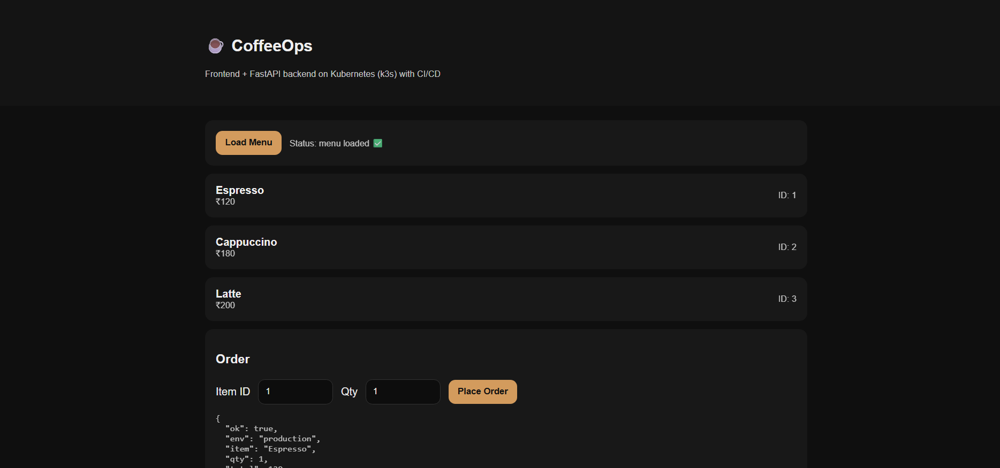

# CoffeeOps ☕️
**FastAPI + Static UI on Kubernetes (k3s) with CI/CD + security scanning**

**Live:** http://64.227.133.210/  
**API:** http://64.227.133.210/api/menu  
**Version:** http://64.227.133.210/api/version  


---

## Why this exists
This repo is a small app with a *real DevOps pipeline*: build → scan → ship → run.

No frameworks. No excuses. Just deployment.

---

## What’s running
- **Frontend:** single HTML file served by Nginx  
- **Backend:** FastAPI service (Python)  
- **Kubernetes:** k3s on a public droplet  
- **Ingress:** Traefik routing `/` and `/api/*`  
- **CI/CD:** GitHub Actions → DockerHub → automatic deploy  
- **Security:** Trivy image scanning on every push

---

## Routing
| Path | Goes to |
|------|---------|
| `/` | frontend |
| `/api/*` | backend |

**Note:** Traefik middleware strips `/api` before sending to backend.  
Example: `/api/menu` → backend receives `/menu`

---

## One-minute proof (copy/paste)

### 1) App is live
```bash
curl -s http://64.227.133.210/api/health
curl -s http://64.227.133.210/api/menu
curl -s http://64.227.133.210/api/version
````

### 2) Pods + replicas

```bash
kubectl get pods -n coffeeops
```

### 3) Real resource usage (CPU/Mem)

```bash
kubectl top pods -n coffeeops
```

---

## CI/CD (what happens on push)

**Push → GitHub Actions**

1. Build Docker image
2. Trivy scan (HIGH/CRITICAL)
3. Push image to DockerHub
4. SSH to server
5. Apply manifests + rollout restart

This repo deploys itself. Like it should.

---

## Repo layout

```bash
.
├── backend/     # FastAPI app + Dockerfile
├── frontend/    # single index.html + Dockerfile (nginx)
├── k8s/         # namespace, deployments, services, ingress
└── .github/     # GitHub Actions pipelines
```

---

## What I’d upgrade next

* immutable image tags (commit SHA) instead of `latest`
* rollback support + deployment history
* monitoring dashboard (Prometheus/Grafana)

````

---

## Why this is better
- Not long
- Not fake “enterprise”
- It shows **proof** and **what matters**
- It reads like a real engineer, not a tutorial bot

---


```md

````
